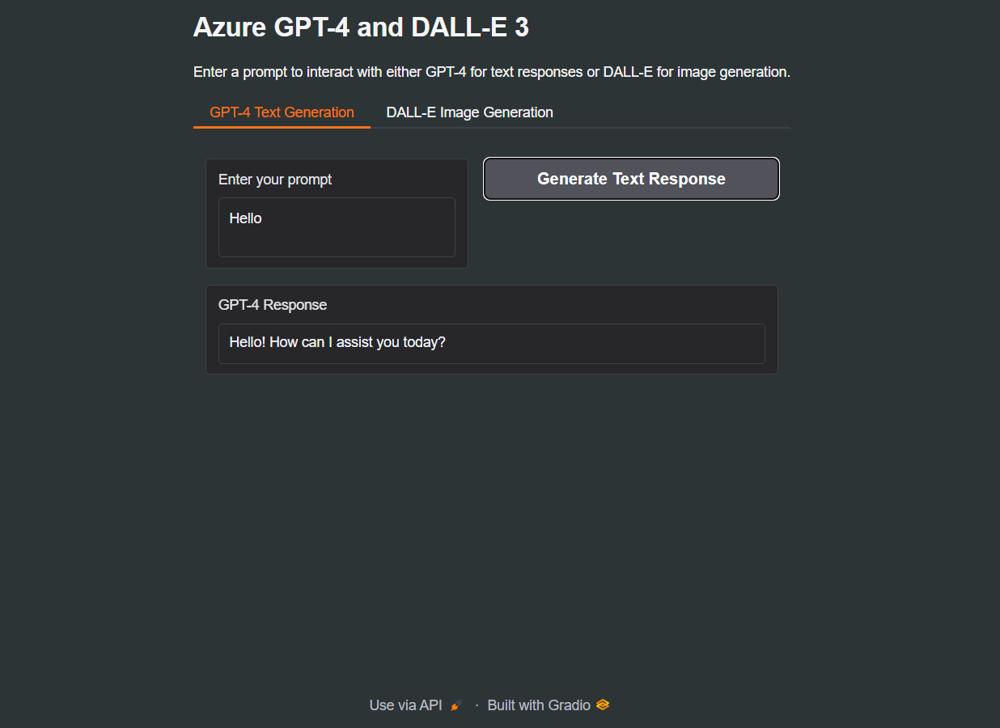

# Azure GPT-4 and DALL-E 3 Integration

This project allows you to interact with **Azure GPT-4** for generating text and **DALL-E 3** for generating images through a user-friendly interface powered by **Gradio**.

## Features:
- **GPT-4 Text Generation**: Enter a prompt and generate meaningful, contextually accurate text responses.
- **DALL-E 3 Image Generation**: Input a text description, and DALL-E 3 will generate a high-quality image based on the prompt.
- **Gradio Interface**: Easily interact with both AI models through a simple and clean web interface.

## Showcase:



## Requirements:
- Python 3.7+
- `requests` library
- `gradio` library
- **API keys** for both **Azure GPT-4** and **DALL-E 3** from OpenAI or Azure platform.

## Setup Instructions:
1. Install dependencies:
    ```bash
    pip install requests gradio python-dotenv
    ```

2. Get API Keys:
    - To use **Azure GPT-4** and **DALL-E 3**, sign up for an account on [Azure](https://azure.microsoft.com/) or [OpenAI](https://platform.openai.com/) and generate API keys.
    - Create a `.env` file in the project root directory and add your API keys as follows:
        ```env
        API_KEY=your_openai_api_key_here
        GPT_ENDPOINT=your_gpt_endpoint_url_here
        IMAGE_ENDPOINT=your_dalle_endpoint_url_here
        ```
      
3. Run the app:
    ```bash
    python app.py
    ```

4. Open your browser and visit the provided URL to interact with the interface.

## How It Works:
- **GPT-4**: Takes a text prompt and provides a conversational AI response.
- **DALL-E 3**: Takes a descriptive text prompt and generates an image based on the input.

## Customizations:
- You can modify the temperature, max tokens, and other parameters for GPT-4 text generation to adjust the style and length of responses.
- For image generation, adjust the image size and the model if required.

## Contributing:
Feel free to fork this repository, submit issues, and create pull requests for improvements.
